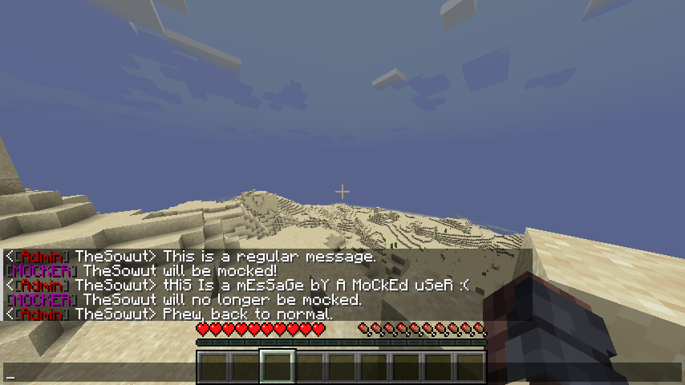

Mocker README
====
 

Mocker is a simple lightweight Spigot plugin that mocks players. 
Each mocked player will get their chat messages modified in a spectacular <italic>mocking spongebob</italic> spirit. 

### Example:

## Usage:

#### Commands:
- /mock \<player\> - toggle mocking of a player persists throughout restarts
- /mocker:reload - reloads the plugin configuration

#### Permissions:
- mocker.mock
- mocker.reload

## Planned Features:
- ✔️ Toggle mocking for all non-op users
